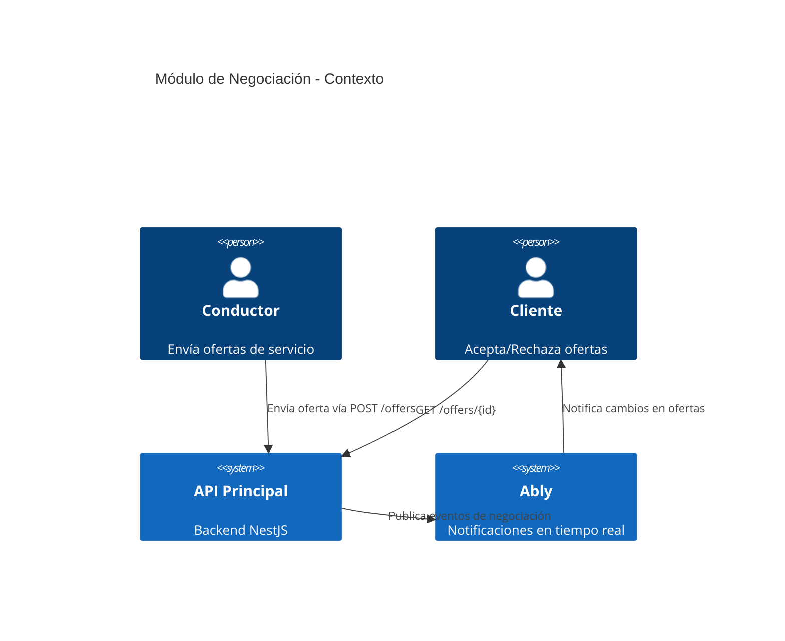

```mermaid
C4Context
  title Módulo de Negociación - Contexto

  Person(conductor, "Conductor", "Envía ofertas de servicio")
  Person(cliente, "Cliente", "Acepta/Rechaza ofertas")
  System(api, "API Principal", "Backend NestJS")
  System(ably, "Ably", "Notificaciones en tiempo real")

  Rel(conductor, api, "Envía oferta vía POST /offers")
  Rel(cliente, api, "GET /offers/{id}")
  Rel(api, ably, "Publica eventos de negociación")
  Rel(ably, cliente, "Notifica cambios en ofertas")
```
